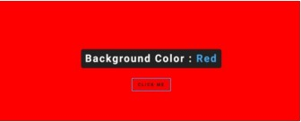

# Proyecto Tres
Instrucciones:
- Crear una página la cual pueda cambiar el color del Background con solo presionar un
Botón.
- La página debe de contar con un mensaje en medio el cual indique de qué color se
encuentra el Background después de presionar el Botón.
- El color debe ser seleccionado de manera aleatoria al momento de presionar el botón.
- Al terminar este proyecto subirlo a GitHub y compartirlo a quien corresponda.

## Imagen de Ejemplo

